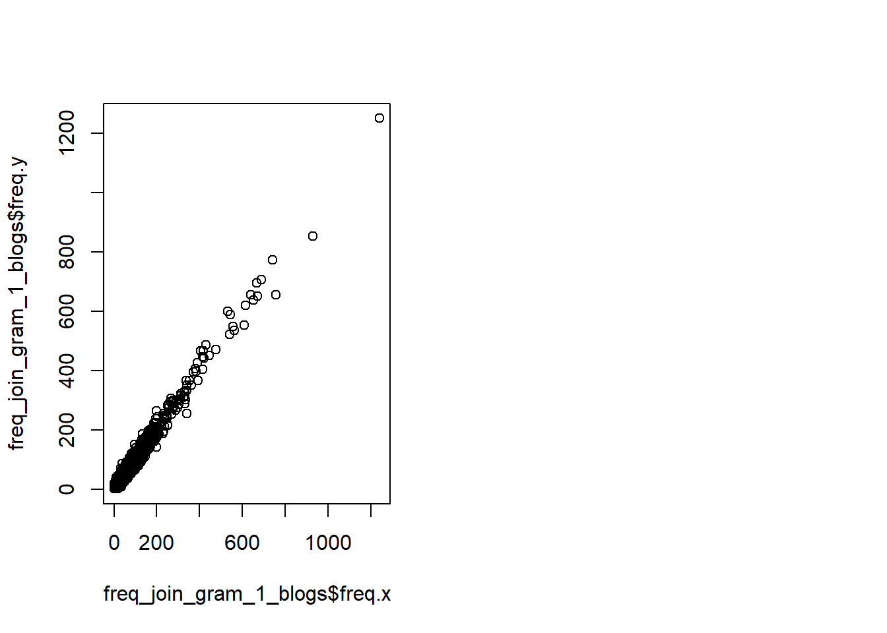

# RCapstone Week2 Writeup
# Introduction

Note to grader: images not loaded in RPubs are shown here.

We analyze here a dataset provided by Swiftkey, which is now part of Microsoft (https://www.microsoft.com/en-us/swiftkey?activetab=pivot_1%3aprimaryr2). The dataset provided has sub-data in four languages (Finnish, Russian, German, and English). We analyze the English data here. Here are the steps in this analysis:

Task 2: Exploratory Data Analysis of the Swift English Dataset as an N-Gram Model

Explore 1-grams, 2-grams, and 3-grams in a 70 percent training sample of the dataset to: 

- Understand the distribution of words and relationship between the words in the corpora.
- Understand frequencies of words and word pairs.
-	Assess how many unique words are needed in a frequency sorted dictionary to cover (50%,90%) of all word instances in the English dataset.

Use wordnet (https://wordnet.princeton.edu/) to: 

- Evaluate if a word is in the English language, which, by inference, can be used to establish that it is from another language.
- Explore ways to increase coverage using synonyms.

Task 3: Draft "Next Word" Prediction Model

- Explore predictions based on the (N-1) gram to compare use of back-off to the (N-1) gram and/or the use of multiple lower order N-Grams. 
- Explore techniques to handle unseen N-Grams.
- Explore N-grams in the testing dataset to predict the next word knowing the previous 1, 2, or 3 words.
- Explore how big an N is needed in our N-Gram model to maximize correct predictions while minimizing response time to user and storage requirements.

Here are the correlations comparing within twitter and blogs.

Here are the most common words found in the testing dataset.

Here are the most common words found in the 70 percent training dataset.

